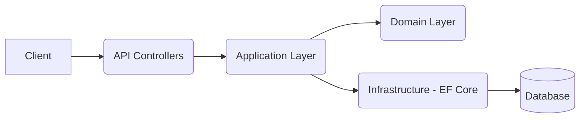

# CodeLeap Assessment – .NET Web API

A RESTful API built with **.NET 8** for the CodeLeap technical assessment, providing authentication, posts, and comments management.

---

## Features

- JWT Authentication  
- CRUD for Posts and Comments  
- Entity Framework Core + SQL Server  
- Swagger / OpenAPI documentation  
- Clean Architecture structure  
- Unit & Integration Tests  

---

## Technologies

- .NET 8, ASP.NET Core Web API  
- Entity Framework Core  
- SQL Server  
- JWT Bearer Authentication  
- Swagger / Swashbuckle  
- xUnit  

---

## Setup Instructions

### Requirements
- .NET 8 SDK  
- SQL Server  

### Configure Database

Edit `appsettings.json`:

```json
"ConnectionStrings": {
  "DefaultConnection": "Server=localhost;Database=CodeLeapDb;Trusted_Connection=True;TrustServerCertificate=True"
}
```

Apply migrations:

```bash
dotnet ef database update
```

---

## Running the Project

```bash
dotnet run --project CodeLeap.API
```

Swagger UI will open automatically.

---

## OpenAPI Documentation

Full OpenAPI document is generated using Swagger.

Access at:

```
https://localhost:<port>/swagger
```

It includes:

- All endpoints  
- Request/response models  
- Authentication requirements  

---

## Authentication

JWT Bearer authentication is used.

### Login Flow

1. Register:

```
POST /api/auth/register
```

2. Login:

```
POST /api/auth/login
```

Response:

```json
{ "token": "eyJhbGciOi..." }
```

3. Use token for protected APIs:

```
Authorization: Bearer <token>
```

Swagger supports authentication via the **Authorize** button.

---

## Architecture

Clean Architecture is applied:



---

## Design Decisions

- **Clean Architecture** → maintainable and testable structure  
- **EF Core** → fast development with migrations  
- **JWT** → stateless, secure authentication  
- **Swagger/OpenAPI** → always up-to-date API documentation  

---

## Testing

Run all tests:

```bash
dotnet test
```

---

## Author

Minh Nhi  
Repository: https://github.com/lyminhnhi/codeleap-assessment
